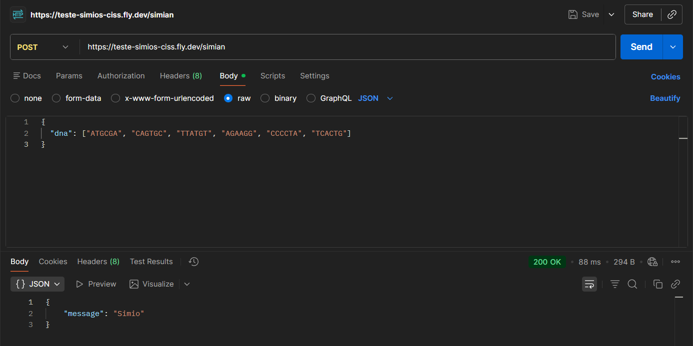
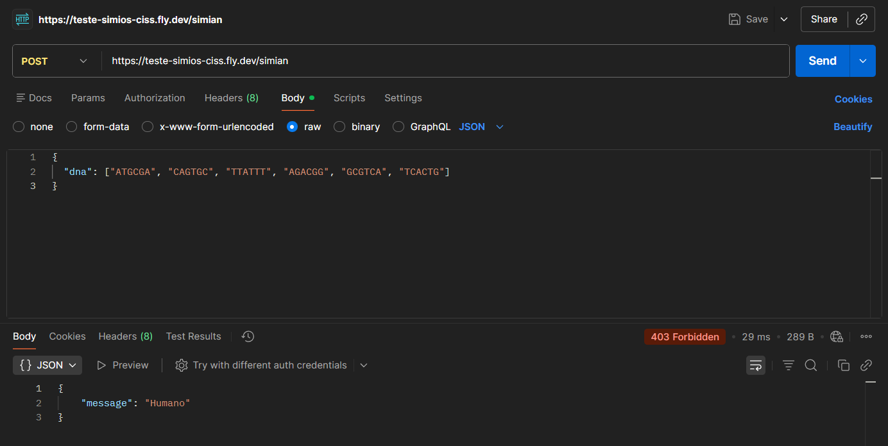

# Teste Símios - CISS

Projeto desenvolvido para o Processo Seletivo da CISS. O objetivo é identificar se uma sequência de DNA pertence a um humano ou a um símio, verificando se existe alguma sequência de 4 letras iguais consecutivas na matriz de DNA.

**Autor:** Frederico de Freitas Luna Filho

---

## Tecnologias

- C++ (G++ 15.2.0)
- [cpp-httplib](https://github.com/yhirose/cpp-httplib)
- [nlohmann/json](https://github.com/nlohmann/json)
- SQLite
- Docker
- Fly.io

---

## Níveis

- ✅ Nível 1 — Algoritmo `isSimian`
- ✅ Nível 2 — API REST hospedada no Fly.io
- ✅ Nível 3 — Banco de dados e estatísticas

---

## Nível 1 — Algoritmo

A função `isSimian` recebe um array de strings com a matriz de DNA e varre nas 4 direções (horizontal, vertical, diagonal principal e diagonal secundária) procurando 4 letras iguais seguidas. Se achar pelo menos uma, retorna `true`, senão `false`.

### Requisitos

- G++ 15.2.0 ou superior

### Compilar e rodar
```bash
cd src
g++ simian.cpp -o simian -std=c++17
./simian
```

### Exemplos

| DNA | Resultado |
|-----|-----------|
| `{"CTGAGA", "CTGAGC", "TATTGT", "AGAGGG", "CCCCTA", "TCACTG"}` | Símio |
| `{"ATGCGA", "AGTCGC", "ATAGTT", "AGAAGG", "ATCCTA", "TCACTG"}` | Símio |
| `{"ATGCGA", "CAGTGC", "TTATTT", "AGACGG", "GCGTCA", "TCACTG"}` | Humano |

---

## Nível 2 — API REST

A API está hospedada no Fly.io, escolhi essa plataforma pois já utilizo para hospedar outro projeto pessoal, o que facilitou o deploy.

**Base URL:** `https://teste-simios-ciss.fly.dev`

### Endpoint
```
POST /simian
```

### Request
```json
{
  "dna": ["ATGCGA", "CAGTGC", "TTATGT", "AGAAGG", "CCCCTA", "TCACTG"]
}
```

### Respostas

| Status | Significa |
|--------|-----------|
| `200 OK` | Símio detectado |
| `403 Forbidden` | Humano detectado |
| `400 Bad Request` | JSON inválido ou sem o campo `dna` |

### Testando a API

#### Via Postman

1. Abra o Postman e crie uma nova requisição
2. Selecione o método **POST**
3. Cole a URL: `https://teste-simios-ciss.fly.dev/simian`
4. Vá na aba **Body** → selecione **raw** → escolha **JSON**
5. Cole o body abaixo e clique em **Send**

**DNA de símio (esperado: 200 OK)**
```json
{
  "dna": ["ATGCGA", "CAGTGC", "TTATGT", "AGAAGG", "CCCCTA", "TCACTG"]
}
```


**DNA humano (esperado: 403 Forbidden)**
```json
{
  "dna": ["ATGCGA", "CAGTGC", "TTATTT", "AGACGG", "GCGTCA", "TCACTG"]
}
```


#### Via curl

**Linux/Mac:**
```bash
# Símio — retorna 200
curl -X POST https://teste-simios-ciss.fly.dev/simian \
  -H "Content-Type: application/json" \
  -d '{"dna":["ATGCGA","CAGTGC","TTATGT","AGAAGG","CCCCTA","TCACTG"]}'

# Humano — retorna 403
curl -X POST https://teste-simios-ciss.fly.dev/simian \
  -H "Content-Type: application/json" \
  -d '{"dna":["ATGCGA","CAGTGC","TTATTT","AGACGG","GCGTCA","TCACTG"]}'
```

**Windows (PowerShell):**
```powershell
# Símio — retorna 200
curl -X POST https://teste-simios-ciss.fly.dev/simian -H "Content-Type: application/json" -d "{\"dna\":[\"ATGCGA\",\"CAGTGC\",\"TTATGT\",\"AGAAGG\",\"CCCCTA\",\"TCACTG\"]}"

# Humano — retorna 403
curl -X POST https://teste-simios-ciss.fly.dev/simian -H "Content-Type: application/json" -d "{\"dna\":[\"ATGCGA\",\"CAGTGC\",\"TTATTT\",\"AGACGG\",\"GCGTCA\",\"TCACTG\"]}"
```

### Rodando localmente
```bash
cd src
g++ api.cpp simian.cpp -o api -I../libs -std=c++17
./api.exe
```

### Rodando com Docker
```bash
docker build -t teste-simios-ciss .
docker run -p 8080:8080 teste-simios-ciss
```

---

## Nível 3 — Banco de dados e estatísticas

Usei SQLite para armazenar os DNAs verificados. O banco garante unicidade — se o mesmo DNA for enviado mais de uma vez, ele é ignorado e não duplica no banco.

O endpoint `/stats` retorna a contagem de DNAs símios, humanos e a proporção entre eles.

### Endpoint
```
GET /stats
```

### Resposta
```json
{
  "count_mutant_dna": 3,
  "count_human_dna": 3,
  "ratio": 0.5
}
```

### Testando via Postman

1. Abra o Postman e crie uma nova requisição
2. Selecione o método **GET**
3. Cole a URL: `https://teste-simios-ciss.fly.dev/stats`
4. Clique em **Send**

### Testando via curl

**Linux/Mac:**
```bash
curl https://teste-simios-ciss.fly.dev/stats
```

**Windows (PowerShell):**
```powershell
curl https://teste-simios-ciss.fly.dev/stats
```

### Sequência de testes para validar o banco

Manda esses DNAs em ordem e verifica o `/stats` no final — a contagem deve bater exatamente com os DNAs únicos enviados.

**Símios (3 únicos):**
```powershell
# 1. Símio horizontal
curl -X POST https://teste-simios-ciss.fly.dev/simian -H "Content-Type: application/json" -d "{\"dna\":[\"ATGCGA\",\"CAGTGC\",\"TTATGT\",\"AGAAGG\",\"CCCCTA\",\"TCACTG\"]}"

# 2. Símio vertical
curl -X POST https://teste-simios-ciss.fly.dev/simian -H "Content-Type: application/json" -d "{\"dna\":[\"ATGCGA\",\"AGTCGC\",\"ATAGTT\",\"AGAAGG\",\"ATCCTA\",\"TCACTG\"]}"

# 3. Símio diagonal
curl -X POST https://teste-simios-ciss.fly.dev/simian -H "Content-Type: application/json" -d "{\"dna\":[\"ATGCGA\",\"CAGAGC\",\"TTAAGT\",\"AGAAGG\",\"CCCATA\",\"TCACTG\"]}"
```

**Humanos (3 únicos):**
```powershell
# 4. Humano
curl -X POST https://teste-simios-ciss.fly.dev/simian -H "Content-Type: application/json" -d "{\"dna\":[\"ATGCGA\",\"CAGTGC\",\"TTATTT\",\"AGACGG\",\"GCGTCA\",\"TCACTG\"]}"

# 5. Humano diferente
curl -X POST https://teste-simios-ciss.fly.dev/simian -H "Content-Type: application/json" -d "{\"dna\":[\"TGCAAG\",\"CTAGTC\",\"GATCAG\",\"TCGAAT\",\"AGCTGA\",\"CATGCT\"]}"

# 6. Humano diferente
curl -X POST https://teste-simios-ciss.fly.dev/simian -H "Content-Type: application/json" -d "{\"dna\":[\"AGTCGA\",\"CTAGTC\",\"GATCAG\",\"TCGAAT\",\"AGCTGA\",\"CATGCT\"]}"
```

**DNAs repetidos (banco deve ignorar):**
```powershell
# 7. Mesmo DNA do teste 1 — não deve duplicar
curl -X POST https://teste-simios-ciss.fly.dev/simian -H "Content-Type: application/json" -d "{\"dna\":[\"ATGCGA\",\"CAGTGC\",\"TTATGT\",\"AGAAGG\",\"CCCCTA\",\"TCACTG\"]}"

# 8. Mesmo DNA do teste 4 — não deve duplicar
curl -X POST https://teste-simios-ciss.fly.dev/simian -H "Content-Type: application/json" -d "{\"dna\":[\"ATGCGA\",\"CAGTGC\",\"TTATTT\",\"AGACGG\",\"GCGTCA\",\"TCACTG\"]}"
```

**Verificar stats (esperado: 3 símios, 3 humanos, ratio 0.5):**
```powershell
curl https://teste-simios-ciss.fly.dev/stats
```

---

## Estrutura
```
TesteTecnicoCISS/
├── docs/
│   ├── postman-simio.png
│   └── postman-humano.png
├── libs/
│   ├── httplib.h
│   └── json.hpp
├── src/
│   ├── simian.cpp
│   ├── simian.h
│   ├── api.cpp
│   ├── database.cpp
│   └── database.h
├── Dockerfile
├── fly.toml
├── CMakeLists.txt
└── README.md
```